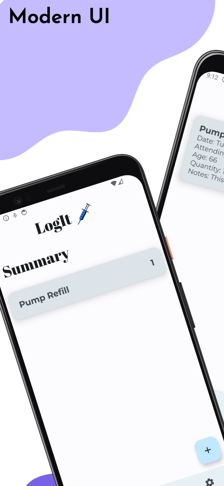
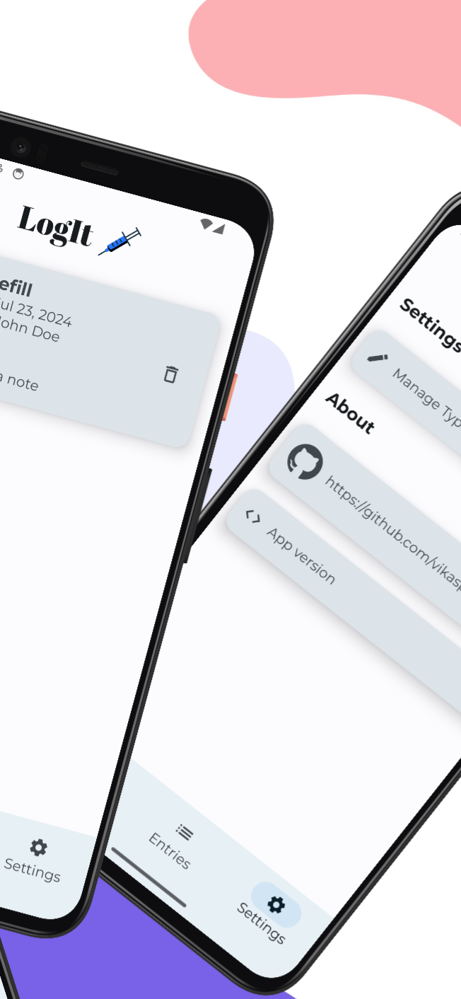
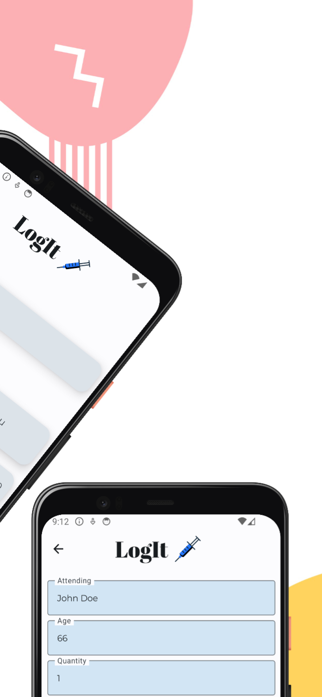
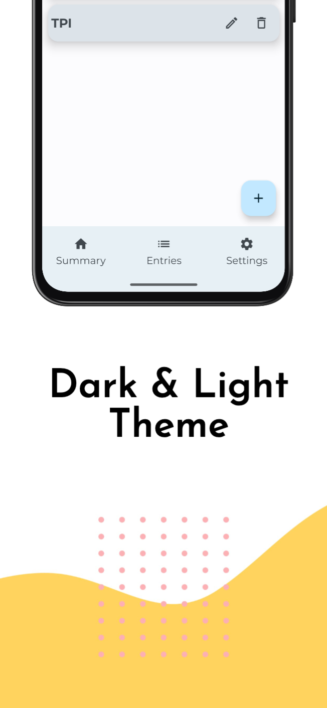
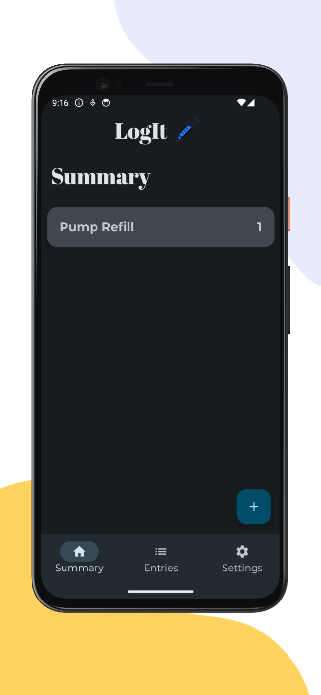

# LogIt

### Open-source, opinionated mobile app for logging your procedures 

[screenshots made by previewed](https://previewed.app/template/00CBF3F6)

## Technologies
- 100% Kotlin.
- Made Using Jetpack Compose.
- Following Clean Architecture approach.
- Following MVVM Architectural Design Pattern.
- 
### Used in the app :
- Room DB
- Hilt
- Preferences DataStore
- Kotlin coroutines
- Kotlin Flows
- Jetpack Compose

## 🤝 Gratitude and Thanks

Thanks to [mhss1/MyBrain](https://github.com/mhss1/MyBrain) app for lots of inspirations
[PieChart](https://medium.com/@developerchunk/create-custom-pie-chart-with-animations-in-jetpack-compose-android-studio-kotlin-49cf95ef321e)
[DataStore DI](https://medium.com/androiddevelopers/datastore-and-dependency-injection-ea32b95704e3)